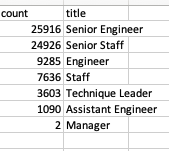

# Pewlett-Hackard-Analysis

## Project Overview
In this project, I used SQl to help Pewllett Hackard detrmine next steps on their retiring employees. This project works out two assignmnets:

1. The number of retitring employees per title
2. Employees who are eligible to participate in a mentorship program

## Resources
- Data Sources: departments.csv, dept_emp.csv, dept_managers.csv, employees.csv, salaries.csv, titles.csv
- Software: PgAdmin, Visual Studio Code 1.38.1

## Results

### Retired Employees by Title
To help Hewlett Pacakrd determine the number of employees retiring by title, I used the titles and employees file to count the number of titles retiring determined by their birth date and as current employees. This returned the data below.

- There are many Senior Engineers retiring from Peweltt Hackard which means these roles will need to be filled.
- There are not may Managers leaving which means there will be lower ranked employees available to be trained and fill the upper roles.

### Mentorship Eligibility
To determine how many retirees are eligible to mentor up in coming employees as the "silver tsunami" goes through, over 1500 employes are eligible to mentor the newer employees to fill the roles of those retiring. This is seen in the "mentorship_eligibility.csv" file.
## Overall Results

- With thousands of senior leaders retiring, new employees need to fill the role.
- All retiring positions are upper management, so lower positions will not need to be filled
- There are over 1500 menotrs eligible to train employees to fill the positions
  
